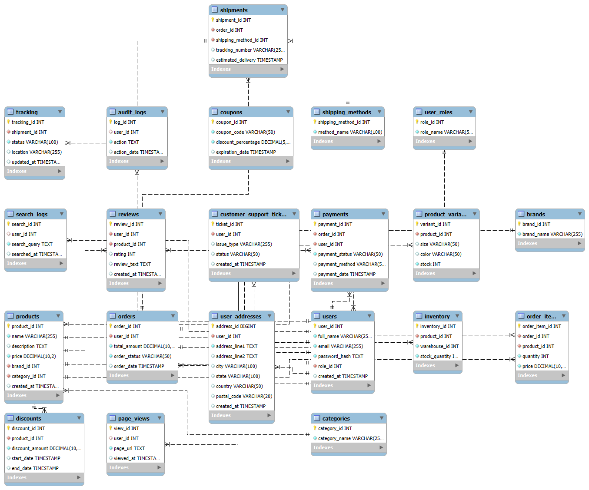

# Engineering an E-Commerce Database: Design, Implementation, and Optimization

## Introduction
This repository contains an optimized **E-Commerce Database** designed using best practices in **database engineering** and **system design**. It includes a structured schema, indexing strategies, and data validation.

## Features
- **Normalization (3NF)**: Reduces redundancy and ensures data integrity.
- **Indexing**: Improves query performance for faster data retrieval.
- **Foreign Key Constraints**: Maintains relationships between entities.
- **Partitioning**: Optimizes query performance for large datasets.
- **ACID Compliance**: Ensures transactional reliability.
- **Efficient Query Execution**: Optimized SQL queries using indexing and caching.

## Entity-Relationship Diagram
The database schema follows a well-defined **Entity-Relationship (ER) Model**:



## Repository Structure
- `EcommerceDatabaseCreation&DataLoad.sql` - Contains SQL scripts for database creation.
- `data/` - Includes CSV files with sample data for testing.
- `er_diagram.png` - Visual representation of the database structure.
- `README.md` - Documentation for this repository.

## Setup Instructions
### 1️⃣ Clone the Repository
```bash
git clone https://github.com/Aravindpanchanathan2799/Ecommerce-Database-Design.git
cd Ecommerce-Database-Design
```

### 2️⃣ Import the Database Schema
Execute the SQL schema file in MySQL:
```sql
SOURCE EcommerceDatabaseCreation&DataLoad.sql;
```

### 3️⃣ Load Sample Data
Use `LOAD DATA INFILE` or run SQL insert queries to populate tables.

### 4️⃣ Verify Setup
Check tables using:
```sql
SHOW TABLES;
SELECT * FROM users LIMIT 5;
```

## Future Enhancements
- Performance benchmarking
- NoSQL integration for scalable storage
- Query optimization for faster analytics

## Acknowledgment
This project was supported by **ChatGPT**, which assisted in generating structured datasets for database validation.

